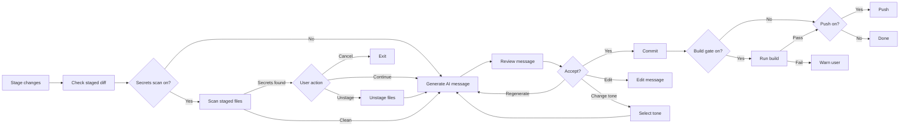
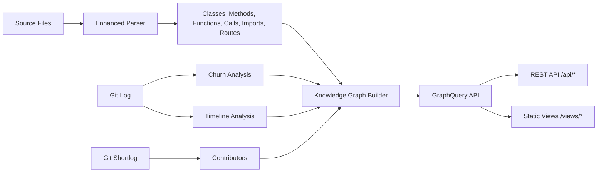
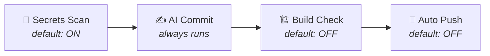
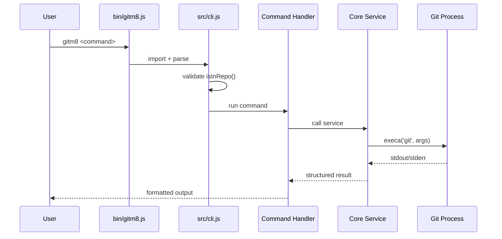
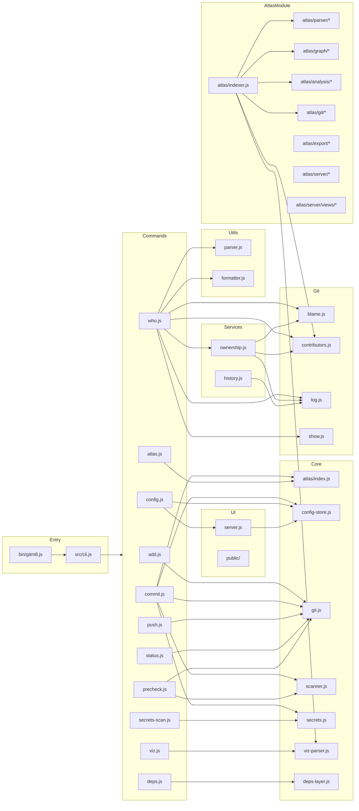
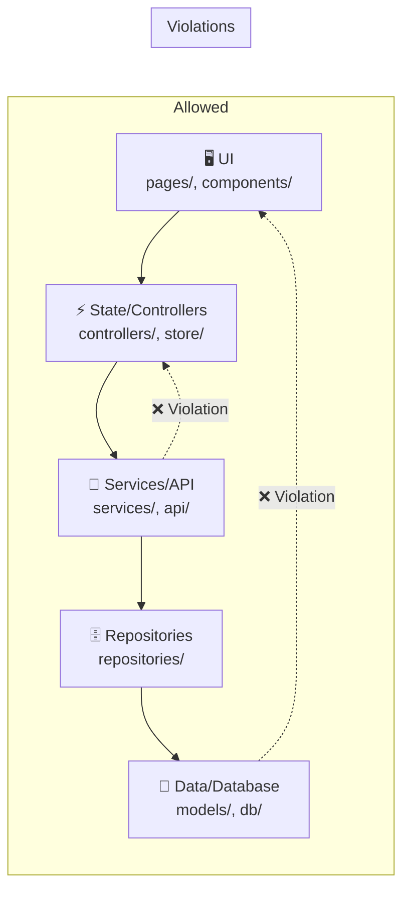

<div align="center">

# gitm8 🤖

**The AI-Powered Git CLI That Does More Than Commits**

[](https://www.npmjs.com/package/gitm8)
[](LICENSE)
[](https://nodejs.org)
[](https://github.com/tharanitharan305/gitm8)

**Scans secrets · Generates commits · Visualizes architecture · Analyzes ownership · Maps dependencies**

```bash
npm install -g gitm8
```

[GitHub Repository](https://github.com/tharanitharan305/gitm8) · [Report Bug](https://github.com/tharanitharan305/gitm8/issues) · [Request Feature](https://github.com/tharanitharan305/gitm8/issues)

</div>

---

## 📋 Table of Contents

- [What is gitm8?](#what-is-gitm8)
- [Features at a Glance](#features-at-a-glance)
- [Installation](#installation)
- [Quick Start](#quick-start)
- [Command Reference](#command-reference)
  - [`gitm8 commit`](#gitm8-commit)
  - [`gitm8 add`](#gitm8-add)
  - [`gitm8 push`](#gitm8-push)
  - [`gitm8 status`](#gitm8-status)
  - [`gitm8 precheck`](#gitm8-precheck)
  - [`gitm8 secrets-scan`](#gitm8-secrets-scan)
  - [`gitm8 viz`](#gitm8-viz)
  - [`gitm8 deps`](#gitm8-deps)
  - [`gitm8 who`](#gitm8-who)
  - [`gitm8 atlas`](#gitm8-atlas)
  - [`gitm8 config`](#gitm8-config)
- [The Pipeline](#the-pipeline)
- [Architecture](#architecture)
- [Project Structure](#project-structure)
- [Module Reference](#module-reference)
- [Configuration Reference](#configuration-reference)
- [Secrets Scanner Rules](#secrets-scanner-rules)
- [Layer Analysis Rules](#layer-analysis-rules)
- [Framework Detection](#framework-detection)
- [Development Guide](#development-guide)
- [Testing](#testing)
- [Troubleshooting](#troubleshooting)
- [Performance](#performance)
- [Security & Privacy](#security--privacy)
- [Roadmap](#roadmap)
- [Contributing](#contributing)

---

## What is gitm8?

**gitm8** is an open-source, AI-powered Git CLI wrapper and repository intelligence platform. It replaces your manual Git workflow with a streamlined, automated pipeline that catches secrets, generates meaningful commit messages, verifies builds before push, and visualizes your code architecture — all from a single command.

Unlike other Git tools, gitm8 combines **developer workflow automation** with **deep codebase intelligence**:

- **Before you commit** → scans for secrets (30+ patterns, zero network calls)
- **During your commit** → generates smart AI commit messages from your staged diff
- **After your commit** → optionally builds and pushes automatically
- **Whenever you need insight** → visualizes architecture, dependencies, ownership, and change patterns

### Why gitm8?

| Problem | gitm8 Solution |
|---------|---------------|
| "I pushed an API key to GitHub again" | 🔐 Secrets scan runs before every commit — 30+ patterns, all local |
| "This commit message is useless" | 🤖 AI generates meaningful messages from your actual diff |
| "Does this code even compile?" | 🏗️ Precheck auto-detects framework and builds before push |
| "Where is this method called from?" | 📊 `gitm8 viz` shows an interactive caller graph |
| "What layer depends on what?" | 🔗 `gitm8 deps` auto-detects architecture layers and violations |
| "Who owns this file / line?" | 👤 `gitm8 who` shows contributor ownership, 100% offline |
| "How has this repo evolved?" | 🗺️ `gitm8 atlas` provides a full repository intelligence platform |
| "I run 5 commands every time" | ⚙️ One pipeline: scan → commit → build → push |

### Design Philosophy

1. **Local-first** — all scanning and analysis runs on your machine; AI commit generation is the only feature requiring a network call
2. **Zero-config where possible** — `viz`, `deps`, `who`, and `secrets-scan` work without any setup
3. **Progressive enhancement** — start with basic commands, enable pipeline stages as you need them
4. **Beautiful output** — color-coded terminals, interactive D3.js visualizations, intuitive TUIs

---

## Features at a Glance

| Feature | Command | What It Does |
|---------|---------|-------------|
| 🔐 **Secrets Scanner** | `gitm8 secrets-scan` | Detects 30+ API keys, tokens, and credential patterns in staged files |
| ✍️ **AI Commit Messages** | `gitm8 commit` | Generates smart commit messages from your staged diff with tone/style control |
| 🏗️ **Build Gate** | `gitm8 precheck` | Auto-detects framework, runs build, blocks push on failure |
| 📊 **Code Visualization** | `gitm8 viz` | Interactive D3.js force-directed graph of class/method relationships + call tree |
| 🔗 **Layer Dependency Analysis** | `gitm8 deps` | Auto-detects architectural layers and visualizes dependencies with violation detection |
| 👤 **Git Ownership Analysis** | `gitm8 who` | Shows who owns every file, line, or the whole repo — 100% offline |
| 🗺️ **Repository Intelligence** | `gitm8 atlas` | Full knowledge graph platform with hotspots, timeline, layers, callflow, and search |
| 🚀 **Smart Push** | `gitm8 push` | Auto-sets upstream branch tracking |
| 🎨 **Smart Add** | `gitm8 add` | Color-coded staging with change summary |
| 🎯 **Colored Status** | `gitm8 status` | Beautiful, color-coded working tree status |
| ⚙️ **Config UI** | `gitm8 config --ui` | Web-based settings management with pipeline toggles |

---

## Installation

### Requirements

- **Node.js** >= 18
- **Git** (any modern version)
- An API key for any OpenAI-compatible provider (for `commit` AI generation only)

> `secrets-scan`, `viz`, `deps`, `who`, `precheck`, `add`, `status`, and `atlas` all work **without any API key**.

### Global Install (recommended)

```bash
npm install -g gitm8
```

### From Source

```bash
git clone https://github.com/tharanitharan305/gitm8.git
cd gitm8
npm install
npm link
```

### From GitHub Packages

```bash
npm install @tharanitharan305/gitm8
```

### Verify Installation

```bash
gitm8 --help
```

---

## Quick Start

```bash
# 1. Configure your AI provider (for commit messages)
gitm8 config set apiKey sk-...
gitm8 config set model gpt-4o-mini

# 2. Make some changes, then stage them
gitm8 add

# 3. Run the full pipeline
gitm8 commit

# 4. Explore your codebase
gitm8 viz         # interactive code relationship diagram
gitm8 deps        # layered architecture analysis
gitm8 who src/    # ownership analysis
gitm8 atlas       # full repository intelligence platform
```

---

## Command Reference

### `gitm8 commit`

Generate AI commit messages and commit staged changes. This is the flagship command — it optionally runs the full **scan → commit → build → push** pipeline.

**Syntax:**
```bash
gitm8 commit [options]
```

**Options:**

| Option | Description |
|--------|-------------|
| `--dry-run` | Show the generated message without committing |
| `-y, --yes` | Skip interactive review and commit immediately |

**Workflow:**



**Interactive Review:**

After generating a message, you are prompted with:

- **Accept and commit** — use the generated message as-is
- **Edit message before committing** — open an editor
- **Regenerate message** — generate a new one with the same tone
- **Change tone and regenerate** — pick a different tone preset or enter a custom one
- **Quit without committing** — cancel the operation

**Tone Presets:**

| Tone | Description |
|------|-------------|
| `neutral` | Neutrally describes changes without stylistic flourish |
| `concise` | Single line, no more than 72 characters |
| `detailed` | Short summary + bullet-point body explaining why and what |
| `formal` | Professional, formal language |
| `casual` | Relaxed, conversational tone |
| `funny` | Light humor while staying informative |
| `custom` | Free-form tone description (e.g., "write like a pirate") |

The tone system prompt is built by the AI module at [src/core/ai.js](src/core/ai.js) — see the `TONE_MAP` constant for exact instructions sent to the model.

**Examples:**
```bash
# Generate a message and review it interactively
gitm8 commit

# Accept the first message without review
gitm8 commit -y

# Preview what would be committed without actually committing
gitm8 commit --dry-run
```

**Exit codes:** `0` on success, `1` on failure (no staged changes, API error, etc.)

---

### `gitm8 add`

Stage files with a color-coded change summary. Wraps `git add`.

**Syntax:**
```bash
gitm8 add [files...]
```

**Examples:**
```bash
# Stage all changes
gitm8 add

# Stage specific files
gitm8 add src/cli.js src/core/ai.js
```

**Output:**
```text
✔ Staged files:
  M    src/cli.js
  A    src/commands/atlas.js
  ??   src/atlas/
```

File status is color-coded:
- 🟡 **M** — Modified
- 🟢 **A** — Added
- 🔴 **D** — Deleted
- 🔵 **R** — Renamed

---

### `gitm8 push`

Push the current branch to origin, automatically setting the upstream if needed.

**Syntax:**
```bash
gitm8 push
```

**What it does:**
1. Reads the current branch name via `git rev-parse --abbrev-ref HEAD`
2. Checks if an upstream is configured via `git rev-parse --abbrev-ref --symbolic-full-name @{upstream}`
3. If upstream exists: runs `git push`
4. If no upstream: runs `git push -u origin <branch>`

---

### `gitm8 status`

Show the working tree status with color-coded output and a staged/unstaged file count summary.

**Syntax:**
```bash
gitm8 status
```

**Output features:**
- Branch name highlighted in cyan
- Section headers color-coded (green for staged, yellow for unstaged, red for untracked)
- File icons: 🟡 modified, 🟢 new, 🔴 deleted, 🔵 renamed
- Summary line: `N staged, M unstaged changes`

---

### `gitm8 precheck`

Detect the project framework, run the build command, and optionally push on success.

**Syntax:**
```bash
gitm8 precheck
```

**Workflow:**
1. Detects the project framework (see [Framework Detection](#framework-detection))
2. If a build command is available, runs it with real-time output streaming
3. On build success: offers to push to the current branch
4. On build failure: blocks push with error details

**Supported Frameworks:**

| Framework | Detection File | Build Command |
|-----------|---------------|---------------|
| Node.js | `package.json` (with build/compile script) | `npm run build` |
| Python | `requirements.txt`, `pyproject.toml`, `setup.py`, etc. | _(skipped — no universal build)_ |
| Rust | `Cargo.toml` | `cargo build` |
| Go | `go.mod` | `go build ./...` |
| .NET | `*.csproj`, `*.sln` | `dotnet build` |
| Dart/Flutter | `pubspec.yaml` | `dart compile exe bin/` |
| Deno | `deno.json`, `deno.jsonc` | _(skipped — no standard build)_ |

> Framework detection logic lives in [src/core/scanner.js](src/core/scanner.js) — each framework has a `qualifies()` function that validates the project actually supports building.

---

### `gitm8 secrets-scan`

Scan staged files for secrets, API keys, tokens, and credentials. Runs locally with zero network calls.

**Syntax:**
```bash
gitm8 secrets-scan
```

**Severity Levels:**

| Severity | Color | Policy |
|----------|-------|--------|
| 🔴 **Critical** | Red | Blocks commit by default — prompts for action |
| 🟡 **High** | Yellow | Prompts for action |
| 🔵 **Medium** | Cyan | Warning only, does not block |
| ⚪ **Low** | Dim | Informational |

**When secrets are found, you can:**
- **Unstage files with secrets** — automatically removes the offending files from staging
- **Continue anyway** — proceed with the commit despite the finding
- **Cancel** — abort the operation

**Detected Patterns (30+):**

| Category | Patterns |
|----------|----------|
| **Cloud Credentials** | AWS Access Key ID, AWS Secret Key, Google API Key, Google OAuth, Azure Connection String, S3 Credentials |
| **Auth Tokens** | GitHub PAT (ghp_/ghu_/gho_/ghs_/ghr_/github_pat_), GitLab Token (glpat-), Slack Token (xox*), Discord Bot Token, Generic Bearer Token, JWT Token |
| **Payment/API Keys** | Stripe Live/Test Keys, Twilio API Key, npm Token, Heroku API Key |
| **Database Strings** | MongoDB, PostgreSQL, MySQL, Redis connection strings with embedded credentials |
| **Private Keys** | RSA/DSA/EC/OPENSSH/PGP private key blocks, .pem/.key/.cert files |
| **Configuration** | .env variables, password/secret/apiKey/token config values, service account JSON (GCP) |
| **Infrastructure** | Docker config auth, JDBC/ODBC strings |

> All pattern definitions are in [src/core/secrets.js](src/core/secrets.js). Context checking and file extension filtering reduce false positives.

---

### `gitm8 viz`

Visualize class/method relationships in an interactive D3.js force-directed graph. Works entirely offline — no AI, no API calls.

**Syntax:**
```bash
gitm8 viz
```

**Supported Languages:**
JavaScript (.js, .jsx, .mjs, .cjs) · TypeScript (.ts, .tsx, .mts, .cts) · Python (.py) · Java (.java) · Dart (.dart)

**What it does:**
1. **Discovers** source files across the project, skipping node_modules, .git, build dirs, and generated files
2. **Parses** each file to extract classes, methods, functions, and call references using language-specific regex patterns
3. **Builds** a relationship graph connecting callers to callees
4. **Starts** an Express server on a random port and opens an interactive D3.js visualization

**Interactive Features:**
- 🖱 **Draggable force-directed graph** — explore architecture visually
- 🔍 **Search bar** — instantly find any class, method, or file (highlights connected nodes)
- 🌳 **Call tree panel** — toggleable sidebar showing the full call hierarchy from entry points to leaves
- 🎯 **Click to highlight** — click any node to trace which methods call it and what it calls
- 📁 **Cross-file relationships** — dashed lines show connections across files
- 🔎 **Smart tooltips** — hover any node to see call counts and parent class info
- 🔌 **100% local** — no network calls

**Example output:**
```bash
$ gitm8 viz

🔍 Code Visualization
  Scanning /Users/me/project...
  ─────────────────────────────────────
  Files found:  45
  Files parsed: 38
  Classes:      12
  Methods:      87
  Functions:    23
  Graph nodes:  122
  Edges:       156
  14 cross-file relationships found
  ─────────────────────────────────────
  Scanned in 0.8s

📊 Code Relationship Diagram
  ─────────────────────────────────────
  http://localhost:51234
  Close the tab or press Ctrl+C when done.
```

---

### `gitm8 deps`

Analyze layered architecture — UI → State → Services → Repositories → Data. Automatically detects layers and dependency relationships with violation detection.

**Syntax:**
```bash
gitm8 deps
```

**What it does:**
1. Discovers all source files (JS/TS, Python, Java, Dart)
2. Classifies each file into an architectural layer based on path patterns
3. Extracts import/require statements across all languages
4. Resolves imports to their target layers
5. Detects **architecture violations** (e.g., UI importing Data directly)
6. Opens an interactive layered dependency diagram

**Built-in Layer Rules:**

| Layer | ID | Color | Path Patterns | Description |
|-------|----|--------|--------------|-------------|
| 🖥️ **UI** | `ui` | `#6c8cff` | `pages/`, `components/`, `screens/`, `widgets/`, `views/`, `containers/`, `layouts/`, `templates/`, `ui/` | React components, Flutter widgets, page files |
| ⚡ **State/Controllers** | `controllers` | `#4ade80` | `controllers/`, `commands/`, `handlers/`, `bloc/`, `cubit/`, `store/`, `redux/`, `state/`, `providers/`, `contexts/`, `actions/`, `hooks/`, `middleware/`, `logic/` | State management, BLoCs, Redux, React hooks |
| 🔧 **Services/API** | `services` | `#f59e0b` | `services/`, `api/`, `usecases/`, `use_cases/`, `graphql/`, `endpoints/` | API clients, external integrations |
| 🗄️ **Repositories** | `repositories` | `#f87171` | `repositories/`, `repo/` | Data access layer, domain repositories |
| 💾 **Data/Database** | `data` | `#a78bfa` | `models/`, `entities/`, `database/`, `db/`, `datasources/`, `dto/` | Database models, schemas, data sources |
| 🧰 **Utils/Config** | `utils` | `#f472b6` | `utils/`, `helpers/`, `lib/`, `config/`, `constants/`, `types/`, `typedefs/`, `common/`, `core/`, `infrastructure/` | Shared utilities, configuration |

**Architectural Enforcement:**
The system enforces a dependency direction: `UI → Controllers → Services → Repositories → Data → Utils`. Any import going in the reverse direction (e.g., Data importing UI) is flagged as a **violation**.

**Visualization:**
- Horizontal color-coded layer bands
- Curved dependency arcs with import counts
- Dashed red arcs for violations
- Click any layer to see violation details and specific files involved
- Hover tooltips show source → target with file examples

**Example output:**
```bash
$ gitm8 deps

🔗 Dependency Layer Analysis
  Scanning /Users/me/project...
  ─────────────────────────────────────
  Files scanned:  45
  Layers:         5
  Dependencies:   8
    UI (Pages/Components)     12 files
    Services / API             8 files
    Repositories               5 files
    Data / Database            6 files
    Utils / Config             4 files

⚠  1 architectural violation found
    data → ui: 3 imports
```

---

### `gitm8 who`

Git ownership and contribution analysis — works 100% offline using only local Git history.

**Syntax:**
```bash
gitm8 who [file|file:line|.] [options]
```

**Modes:**

#### File Mode
```bash
gitm8 who src/cli.js
```

Shows contributor ownership breakdown with visual bars:
- 👥 Each contributor with name, commit count, and ownership percentage
- 📊 Proportional visual bars per contributor
- 📅 File creation date
- 🔄 Last modification timestamp

#### Line Mode
```bash
gitm8 who src/cli.js:42
```

Drills into a single line using `git blame`:
- 👤 Author name and email
- 🔖 Full commit SHA and message
- 📁 All files changed in that commit
- 📊 Insertions/deletions
- 📜 Line history (created date, modification count, last change)

#### Repository Mode
```bash
gitm8 who .
```

Repository-level overview:
- 🏆 Top contributors sorted by commit count
- 📄 Most modified files
- 📁 Most active directories (hotspot analysis)
- ⏱ Recent activity with message previews

#### Interactive Mode
```bash
gitm8 who
```

No arguments launches a guided TUI with `@clack/prompts`:
1. 👥 **Browse Contributors** — select a contributor → see recent commits
2. 📜 **Browse Commits** — pick a commit → see files changed + diff stats
3. 📄 **Browse Files** — select a file → see ownership breakdown
4. 🔍 **Blame a File** — enter any file path → see blame or ownership

**Options:**

| Flag | Description |
|------|-------------|
| `--json` | Machine-readable JSON output |
| `--open` | Open commit in browser (GitHub/GitLab/Bitbucket) |
| `--history` | Show full modification history (up to 50 commits) |
| `--stats` | Detailed ownership statistics (total authors, top contributor, average) |
| `--verbose` | Raw Git metadata (all blame fields) |

---

### `gitm8 atlas`

**Interactive Repository Intelligence Platform** — the most powerful command in gitm8. Builds a full knowledge graph of your codebase and provides an interactive web UI with multiple analytical views.

**Syntax:**
```bash
gitm8 atlas [options]
```

**Options:**

| Option | Description |
|--------|-------------|
| `--headless` | Do not open browser automatically |
| `--export <format>` | Export mode: `json`, `mermaid`, `svg` |
| `--output <file>` | Output file for export (use `-` for stdout) |
| `--watch` | Watch files for changes and live-update |
| `--no-cache` | Force re-indexing from scratch (ignore `.gitm8-atlas/` cache) |
| `--verbose` | Show detailed progress information |
| `--view <name>` | Open a specific view: `report`, `architecture`, `layers`, `callflow`, `hotspots`, `timeline`, `search` |

**What it does:**
1. **Discovers** all source files in the project
2. **Parses** each file using the enhanced parser — extracts classes, methods, functions, calls, imports, API routes
3. **Collects Git intelligence** — commit churn per file, commit timeline, contributor data
4. **Analyzes complexity** — estimates cyclomatic complexity per file
5. **Builds a Knowledge Graph** — a rich graph database in memory with typed nodes (file, class, method, function, folder, route, contributor) and typed edges (contains, imports, calls, extends, owns)
6. **Starts a server** with a REST API and self-contained D3.js views
7. **Caches** the result in `.gitm8-atlas/` for instant subsequent loads

**Available Views:**

| View | URL | Description |
|------|-----|-------------|
| **Report** | `/views/report` | Dashboard with stats, charts, hotspot table, recent activity |
| **Architecture** | `/views/architecture` | Interactive force-directed graph of the full knowledge graph |
| **Layers** | `/views/layers` | Layer dependency diagram with violation detection |
| **Call Flow** | `/views/callflow` | Call tree explorer — pick a root function, see the call tree |
| **Hotspots** | `/views/hotspots` | Files ranked by churn × complexity — find what needs refactoring |
| **Timeline** | `/views/timeline` | Commit activity over time |
| **Search** | `/views/search` | Full-text search across all graph nodes |

**Architecture:**


**Export Formats:**

| Format | File Extension | Description |
|--------|---------------|-------------|
| `json` | `.json` | Full knowledge graph serialization |
| `mermaid` | `.md` | Mermaid class diagram or flowchart |
| `svg` | `.svg` | Statistical bar chart (stats view) or export instructions |

**Knowledge Graph Schema:**

**Node types:** `repository`, `folder`, `file`, `class`, `interface`, `enum`, `method`, `function`, `variable`, `route`, `export`, `decorator`, `dependency`, `test`, `commit`, `contributor`

**Edge types:** `contains`, `imports`, `exports`, `calls`, `extends`, `implements`, `renders`, `tests`, `owns`, `modified_by`, `introduced_in`, `depends_on`, `connected_to`

**Example:**
```bash
# Open the default report view
gitm8 atlas

# Open a specific view headlessly
gitm8 atlas --view hotspots --headless

# Export the graph as JSON
gitm8 atlas --export json --output graph.json

# Export as a Mermaid flowchart
gitm8 atlas --export mermaid --output architecture.md

# Force re-index from scratch
gitm8 atlas --no-cache

# Watch mode with verbose output
gitm8 atlas --watch --verbose
```

---

### `gitm8 config`

Manage gitm8 configuration via CLI or web UI.

**Syntax:**
```bash
gitm8 config <subcommand> [args...] [options]
```

**Subcommands:**

| Subcommand | Description | Example |
|------------|-------------|---------|
| `get <key>` | Get a config value | `gitm8 config get tone` |
| `set <key> <value>` | Set a config value | `gitm8 config set tone detailed` |
| `list` | List all config values | `gitm8 config list` |

**Options:**

| Option | Description |
|--------|-------------|
| `--ui` | Open the settings web UI in a browser |

**Config UI:**
```bash
gitm8 config --ui
```
Opens a self-contained web interface on `http://localhost:PORT` with:
- AI Provider settings (API URL, key, model)
- Commit Style settings (format, tone, custom tone, max diff chars)
- Pipeline automation toggles (secrets scan, build check, auto-push)
- Visual pipeline flow diagram

---

## The Pipeline

The pipeline is the heart of `gitm8 commit`. It chains multiple stages into one automated flow:



Each stage is independently configurable:

| Pipeline Stage | Config Key | Default | Description |
|---------------|-----------|---------|-------------|
| 🔐 Secrets Scan | `pipelineSecretsScan` | `true` | Scans staged files for 30+ secret patterns |
| 🏗️ Build Check | `pipelinePrecheck` | `false` | Auto-detects framework and runs build |
| 🚀 Auto-Push | `pipelineAutoPush` | `false` | Pushes to upstream after successful commit+build |

**Behavior:**
- If **Secrets Scan** finds critical/high secrets: prompts to unstage, continue, or cancel
- If **Build Check** fails: the commit still goes through, but push is blocked with an error
- If **Auto-Push** is enabled but build fails: push is skipped with a warning

Configure via CLI:
```bash
gitm8 config set pipelinePrecheck true
gitm8 config set pipelineAutoPush true
```

Or via the web UI:
```bash
gitm8 config --ui
```

---

## Architecture

### High-Level Architecture

```mermaid
flowchart TD
    subgraph CLI [CLI Layer]
        gitm8["bin/gitm8.js"]
        CLI["src/cli.js<br/>Commander.js"]
    end

    subgraph Commands [Command Handlers]
        ADD["src/commands/add.js"]
        COMMIT["src/commands/commit.js"]
        PUSH["src/commands/push.js"]
        STATUS["src/commands/status.js"]
        CONFIG_C["src/commands/config.js"]
        PRECHECK["src/commands/precheck.js"]
        SECRETS["src/commands/secrets-scan.js"]
        VIZ["src/commands/viz.js"]
        DEPS["src/commands/deps.js"]
        WHO["src/commands/who.js"]
        ATLAS_C["src/commands/atlas.js"]
    end

    subgraph Core [Core Services]
        AI["src/core/ai.js<br/>AI Commit Generation"]
        CONFIG["src/core/config-store.js<br/>conf-based settings"]
        GIT["src/core/git.js<br/>Basic git operations"]
        SCANNER["src/core/scanner.js<br/>Framework detection"]
        SECRETS_CORE["src/core/secrets.js<br/>30+ secret patterns"]
        VIZ_PARSER["src/core/viz-parser.js<br/>Multi-language parser"]
        DEPS_LAYER["src/core/deps-layer.js<br/>Layer analysis"]
    end

    subgraph GitServices [Git Services]
        BLAME["src/git/blame.js<br/>git blame porcelain"]
        CONTRIB["src/git/contributors.js<br/>git shortlog"]
        LOG["src/git/log.js<br/>git log"]
        SHOW["src/git/show.js<br/>git diff-tree"]
    end

    subgraph BizServices [Business Services]
        OWNERSHIP["src/services/ownership.js"]
        HISTORY["src/services/history.js"]
    end

    subgraph Utils [Utilities]
        PARSER["src/utils/parser.js<br/>File/line parsing"]
        FORMATTER["src/utils/formatter.js<br/>Terminal formatting"]
    end

    subgraph UI [Configuration UI]
        UI_SERVER["src/ui/server.js<br/>Express server"]
        UI_PUBLIC["src/ui/public/<br/>HTML/CSS/JS SPA"]
    end

    subgraph Atlas [Atlas Intelligence Engine]
        ATLAS["src/atlas/index.js<br/>Orchestrator"]
        INDEXER["src/atlas/indexer.js<br/>Indexing pipeline"]
        E_PARSER["src/atlas/parser/<br/>Enhanced parsing"]
        GRAPH["src/atlas/graph/<br/>Knowledge graph"]
        ANALYSIS["src/atlas/analysis/<br/>Complexity, layers"]
        GIT_INTEL["src/atlas/git/<br/>Churn, hotspots, timeline"]
        EXPORT["src/atlas/export/<br/>JSON, Mermaid, SVG"]
        ASERVER["src/atlas/server/<br/>Express + REST API"]
        VIEWS["src/atlas/server/views/<br/>D3.js dashboards"]
    end

    CLI --> Commands
    COMMIT --> AI
    COMMIT --> GIT
    COMMIT --> SECRETS_CORE
    COMMIT --> SCANNER
    COMMIT --> CONFIG
    SECRETS --> SECRETS_CORE
    PRECHECK --> SCANNER
    PRECHECK --> GIT
    VIZ --> VIZ_PARSER
    DEPS --> DEPS_LAYER
    WHO --> OWNERSHIP
    WHO --> BLAME
    WHO --> CONTRIB
    WHO --> LOG
    WHO --> SHOW
    WHO --> PARSER
    WHO --> FORMATTER
    OWNERSHIP --> BLAME
    OWNERSHIP --> CONTRIB
    OWNERSHIP --> LOG
    HISTORY --> LOG
    ATLAS_C --> ATLAS
    ATLAS --> INDEXER
    INDEXER --> VIZ_PARSER
    INDEXER --> E_PARSER
    INDEXER --> GRAPH
    INDEXER --> GIT_INTEL
    INDEXER --> ANALYSIS
    INDEXER --> CONTRIB
    ASERVER --> GRAPH
    ASERVER --> VIEWS
    CONFIG_C --> CONFIG
    CONFIG_C --> UI_SERVER
    UI_SERVER --> CONFIG
```

### Command Execution Flow



### Module Dependency Map



---

## Project Structure

```text
gitm8/
├── bin/
│   └── gitm8.js                    # CLI entry point (shebang + import)
├── src/
│   ├── cli.js                      # Commander.js command definitions
│   ├── commands/
│   │   ├── add.js                  #  gitm8 add — stage files
│   │   ├── commit.js               #  gitm8 commit — pipeline orchestration
│   │   ├── push.js                 #  gitm8 push — smart push
│   │   ├── status.js               #  gitm8 status — colored status
│   │   ├── config.js               #  gitm8 config — settings management
│   │   ├── precheck.js             #  gitm8 precheck — build gate
│   │   ├── secrets-scan.js         #  gitm8 secrets-scan — secret detection
│   │   ├── viz.js                  #  gitm8 viz — code visualization
│   │   ├── deps.js                 #  gitm8 deps — layer analysis
│   │   ├── who.js                  #  gitm8 who — ownership analysis
│   │   └── atlas.js                #  gitm8 atlas — repository intelligence
│   ├── core/
│   │   ├── ai.js                   # AI commit message generation (OpenAI API)
│   │   ├── config-store.js         # Persistent config via 'conf' library
│   │   ├── git.js                  # Basic git operations (add, commit, push, diff, status)
│   │   ├── scanner.js              # Multi-framework detector
│   │   ├── secrets.js              # 30+ secret regex patterns + staged-file scan
│   │   ├── viz-parser.js           # Multi-language code parser for viz
│   │   └── deps-layer.js           # Layer detection + dependency analysis
│   ├── git/
│   │   ├── blame.js                # git blame porcelain parser
│   │   ├── contributors.js         # git shortlog, most-modified files, active dirs
│   │   ├── log.js                  # git log with structured parsing
│   │   └── show.js                 # git diff-tree, commit details, remote URL builder
│   ├── services/
│   │   ├── ownership.js            # File/line/repo ownership aggregation
│   │   └── history.js              # Line-level modification history (git log -L)
│   ├── utils/
│   │   ├── parser.js               # file:line parsing, repo validation, binary detection
│   │   └── formatter.js            # Terminal output formatting, date formatting
│   ├── ui/
│   │   ├── server.js               # Express config UI server
│   │   └── public/
│   │       ├── index.html          # Config SPA
│   │       ├── app.js              # Config SPA logic
│   │       └── style.css           # Dark theme styles
│   └── atlas/
│       ├── index.js                # Atlas orchestrator
│       ├── indexer.js              # File discovery → parsing → git intel → graph → cache
│       ├── progress.js             # Progress reporter (spinner + progress bar)
│       ├── parser/
│       │   ├── enhanced-parser.js  # Enhanced multi-language parser (adds imports + routes)
│       │   ├── imports.js          # Import resolution logic
│       │   └── routes.js           # Express/FastAPI/Spring/Next.js route detection
│       ├── graph/
│       │   ├── builder.js          # Knowledge graph builder from parsed files
│       │   ├── nodes.js            # Node type definitions + factory functions
│       │   ├── edges.js            # Edge type definitions + factory functions
│       │   └── query.js            # GraphQuery API (get, search, neighbors, expand, hotspots)
│       ├── analysis/
│       │   ├── complexity.js       # Cyclomatic complexity estimation
│       │   └── layers.js           # Layer detection (re-exports from deps-layer)
│       ├── git/
│       │   ├── churn.js            # File churn analysis from git log --numstat
│       │   ├── hotspots.js         # Hotspot scoring (churn × complexity)
│       │   └── timeline.js         # Commit timeline extraction
│       ├── export/
│       │   ├── json.js             # JSON graph export
│       │   ├── mermaid.js          # Mermaid diagram export
│       │   └── svg.js              # SVG export + stats SVG generator
│       ├── server/
│       │   ├── server.js           # Express server factory
│       │   └── routes/
│       │       ├── api.js          # REST API endpoints (/api/graph, /api/search, etc.)
│       │       └── static.js       # View router (/views/:name)
│       └── ui/
│           ├── shared-styles.js    # Shared D3 visualization styles
│           └── components/
│               ├── force-graph.js   # Force-directed graph component
│               ├── inspector.js     # Node inspector component
│               ├── mini-map.js      # Mini-map navigation component
│               └── search-box.js    # Search component
├── test/
│   └── who.test.js                # 22 tests: parser, formatter, integration
├── package.json
├── package-lock.json
├── .gitignore
└── README.md
```

---

## Module Reference

### `src/core/ai.js` — AI Commit Generation

**Purpose:** Generates commit messages from staged diffs using any OpenAI-compatible API.

**Key exports:**
- `generateCommitMessage(diff)` — send the diff to the AI, return a commit message
- `TONE_MAP` — tone preset definitions
- `buildSystemPrompt()` — assemble the system message from config
- `truncateDiff(diff, maxChars)` — smart diff truncation (prioritizes headers)

**Flow:**
1. Read config: `apiBaseUrl`, `apiKey`, `model`, `maxDiffChars`
2. Build system prompt from tone + style settings
3. Truncate diff to `maxDiffChars` (default 6000) — headers take priority
4. POST to `{apiBaseUrl}/chat/completions` with temperature 0.4
5. Parse response, handle streaming/non-JSON errors

**Design decisions:**
- Temperature 0.4 balances creativity with consistency
- Headers are prioritized in truncation to preserve file structure context
- Streaming responses are detected and reported with a helpful error message

### `src/core/config-store.js` — Configuration Store

**Purpose:** Persistent configuration using the `conf` library (JSON file in `~/.config/gitm8/config.json`).

**Key exports:**
- `get(key)` — get a config value
- `set(key, value)` — set a config value with type coercion
- `list()` — get all entries with masked API keys
- `getConfigPath()` — path to the config file

**Schema validation:** Enforces `commitStyle` enum, `maxDiffChars` range (1000–50000), boolean for pipeline toggles.

### `src/core/git.js` — Git Operations

**Purpose:** Thin wrapper around common git operations using `execa`.

**Key exports:**
- `isInRepo()` — check if CWD is a git repo
- `add(files)` — stage files
- `getStagedSummary()` — `git diff --cached --name-status`
- `getStagedDiff()` — `git diff --cached`
- `commit(message)` — `git commit -m`
- `getCurrentBranch()` — `git rev-parse --abbrev-ref HEAD`
- `hasUpstream()` — check upstream tracking
- `push()` — push, auto-setting upstream
- `getStatus()` / `getShortStatus()` — `git status` / `git status --short`

### `src/core/scanner.js` — Framework Detection

**Purpose:** Auto-detects the project framework by scanning for indicator files.

**Detectors:** Node.js, Python, Rust, Go, Deno, .NET, Dart/Flutter

**Key exports:**
- `detectFramework()` — returns `{ name, label, buildCmd, testCmd }`
- `hasUncommittedChanges()` — check for uncommitted changes

Each detector has:
- `indicatorFiles` — files to look for
- `qualifies()` — additional check (e.g., does `package.json` have a build script?)
- `buildCmd` / `testCmd` — commands to run

### `src/core/secrets.js` — Secrets Scanner

**Purpose:** Scans staged file content for 30+ secret patterns across 4 severity levels.

**Key exports:**
- `scanStagedSecrets()` — scan all staged files, return findings
- `isSensitiveFile(filePath)` — heuristic check for sensitive filenames

**Key design:**
- All pattern matching is local regex — zero network calls
- Context checking reduces false positives (e.g., Base64 strings near auth keywords)
- File extension filtering (e.g., only scan `.json` files for service account patterns)
- `.env` files get special treatment — every `KEY=value` pair is flagged

### `src/core/viz-parser.js` — Code Parser for Viz

**Purpose:** Extracts classes, methods, functions, and call relationships from source code.

**Supported languages:** JavaScript, TypeScript/TSX, Python, Java, Dart

**Key exports:**
- `parseFile(filePath, rootDir)` — parse a single file
- `discoverFiles(rootDir)` — find all parseable files (skips node_modules, .git, build dirs)
- `buildGraph(parsedFiles)` — build nodes + edges from parsed results

**Parsing strategy:**
- Line-by-line scan with brace-depth tracking (for brace-delimited languages)
- Indentation tracking for Python
- Skip comments, imports, and known keywords
- Method detection requires being at the correct brace depth within a class
- Call extraction via regex, cross-referenced against known definitions

### `src/core/deps-layer.js` — Layer Dependency Analysis

**Purpose:** Classifies files into architectural layers and detects dependency violations.

**Key exports:**
- `analyzeLayers(rootDir)` — complete layer analysis
- `LAYER_DEFS` — layer pattern definitions

**Layer detection:** Path-based classification (e.g., files in `pages/` → UI, files in `services/` → Services)

**Import resolution:** Follows Node.js module resolution for relative paths (checks `.ts`, `.tsx`, `.js`, `.jsx`, `/index.ts`, etc.)

### `src/git/blame.js` — Git Blame Parser

**Purpose:** Parses `git blame -p --incremental` porcelain output into structured data.

**Key exports:**
- `getBlame(filePath, opts)` — full blame output for a file
- `getBlameForLine(filePath, line)` — blame for a single line

Parses the incremental format with fields: author, author-mail, author-time, committer, summary, previous, filename.

### `src/git/contributors.js` — Contribution Analysis

**Purpose:** Extracts contributor statistics from git history.

**Key exports:**
- `getContributors(opts)` — top contributors via `git shortlog -sne`
- `getFileContributors(filePath)` — contributors for a specific file
- `getMostModifiedFiles(opts)` — files ranked by commit count
- `getMostActiveDirectories(opts)` — directories ranked by commit count

### `src/git/log.js` — Git Log Parser

**Purpose:** Structured parsing of `git log` output with custom delimiters.

**Key exports:**
- `getLog(opts)` — structured log entries
- `countFileCommits(filePath)` — total commits for a file
- `countRepoCommits()` — total repo commits
- `getFirstCommit(filePath)` — first commit touching a file
- `getLastCommit(filePath)` — most recent commit touching a file

Uses `\x1f` (unit separator) between fields and `\x1e` (record separator) between records for safe parsing.

### `src/git/show.js` — Commit Details

**Purpose:** Detailed commit information using `git diff-tree` and remote URL building.

**Key exports:**
- `getCommitDetails(commitHash)` — author, date, message, insertions, deletions, file list
- `getCommitDiff(commitHash)` — raw diff output
- `getCommitUrl(commitHash)` — build GitHub/GitLab/Bitbucket commit URL

### `src/utils/parser.js` — Input Parsers

**Purpose:** Command-line input parsing and repository validation.

**Key exports:**
- `parseFileLine(input)` — parse `file:line` syntax
- `validateFile(parsed)` — validate file exists, is tracked by git, line number is valid
- `isBinaryFile(filePath)` — detect binary files by extension and null-byte heuristic
- `getRepoRoot()` — `git rev-parse --show-toplevel`
- `isRepoEmpty()` — check for zero commits
- `isDetachedHead()` / `isShallowClone()` — repo state checks

### `src/utils/formatter.js` — Output Formatting

**Purpose:** Terminal output formatting with colored bars, tables, and date formatting.

**Key exports:**
- `formatLineBlame(data, opts)` — formatted line blame output
- `formatFileOwnership(data, opts)` — formatted file ownership
- `formatRepoContributors(data, opts)` — formatted repo overview
- `formatRelativeDate(dateInput)` — "2 hours ago", "3 days ago"
- `formatTimestamp(timestamp)` — "Jul 4, 2026"

---

## Configuration Reference

All configuration is stored in `~/.config/gitm8/config.json` (managed by the `conf` library).

| Key | Type | Default | Allowed Values | Description |
|-----|------|---------|---------------|-------------|
| `apiBaseUrl` | string | `https://api.openai.com/v1` | Any valid URL | OpenAI-compatible API endpoint |
| `apiKey` | string | `""` | Any string | API key (never stored in plaintext in output) |
| `model` | string | `gpt-4o-mini` | Any model string | Model identifier |
| `tone` | string | `concise` | `neutral`, `concise`, `detailed`, `formal`, `casual`, `funny`, `custom` | Commit message tone preset |
| `customTone` | string | `""` | Any string | Free-form tone instructions (used when `tone=custom`) |
| `commitStyle` | string | `conventional` | `conventional`, `freeform` | Commit message format |
| `maxDiffChars` | number | `6000` | 1000–50000 | Max diff characters sent to AI |
| `pipelineSecretsScan` | boolean | `true` | `true`, `false` | Run secrets scan before commit |
| `pipelinePrecheck` | boolean | `false` | `true`, `false` | Run build after commit |
| `pipelineAutoPush` | boolean | `false` | `true`, `false` | Auto-push after commit+build |

### Managing Config

```bash
# CLI
gitm8 config set apiKey sk-...
gitm8 config set model gpt-4o-mini
gitm8 config set tone casual
gitm8 config set pipelinePrecheck true
gitm8 config get tone
gitm8 config list

# Web UI (recommended for new users)
gitm8 config --ui
```

---

## Secrets Scanner Rules

The secrets scanner uses regex pattern matching across 4 severity levels. Key design:

- **`contextCheck`** patterns (like Base64) require auth-related keywords nearby
- **`fileFilter`** restricts patterns to specific file extensions (e.g., `.json` for service accounts)
- **`.env` files** get special handling — every `KEY=value` pair is flagged by default
- **All matching is local** — zero network calls, zero data leakage

For the complete list of 30+ patterns with descriptions, see [src/core/secrets.js](src/core/secrets.js).

---

## Layer Analysis Rules

The layer analyzer enforces: `UI → Controllers → Services → Repositories → Data → Utils`



**Violation detection** flags any import that goes against this direction (e.g., a model file importing a UI component).

---

## Framework Detection

The framework detector at [src/core/scanner.js](src/core/scanner.js) uses a modular detector pattern:

```javascript
// Each framework defines:
{
  name: 'node',
  label: 'Node.js',
  indicatorFiles: ['package.json'],
  buildCmd: 'npm run build',
  qualifies: () => {
    // Does package.json have a build script?
  }
}
```

**Resolution order:** Node.js → Python → Rust → Go → Deno → .NET → Dart → Unknown

Files are checked in order; the first match wins. The `qualifies()` function adds an extra validation layer (e.g., Node.js requires `package.json` to have a `build` or `compile` script).

---

## Development Guide

### Architecture Rules

1. **Commands never call git directly** — use `src/core/git.js` or `src/git/*.js` services
2. **Core services are stateless** — config is the only global state (via `config-store.js`)
3. **Every command is a default export function** in `src/commands/<name>.js`
4. **Express servers use port 0** (random available port) — never hardcode ports
5. **All git interaction uses `execa`** — never `child_process.spawn` directly
6. **Terminal output uses `picocolors`** — never raw ANSI escape codes

### Adding a New Command

1. Create `src/commands/<name>.js` with a default export async function
2. Import and register in `src/cli.js` using `program.command(...).action(...)`
3. Use `requireRepo()` for commands that need a git repository
4. Use `@clack/prompts` for interactive flows
5. Use `picocolors` for all colored output

### Adding a Parser

1. Add the language extension to `EXT_MAP` in the relevant parser
2. Add language config with class/method/function regex patterns
3. Add the language to IMPORT_RE in `deps-layer.js` if import extraction is needed

### Adding a Git Service

1. Create the service in `src/git/<name>.js`
2. Use `execa` for all git subprocess calls
3. Export structured data (never raw git output)
4. Set reasonable timeouts (30s default, 60s for large operations)

### Coding Conventions

- **ESM modules only** — `import`/`export`, no `require()`
- **JSDoc typedefs** for all data structures
- **Async/await** for all asynchronous operations
- **No TypeScript** — the project uses vanilla JS with JSDoc types
- **Default exports** for command handlers; named exports for utilities
- **Error handling** — commands handle errors with `process.exit(1)`; utilities throw

### Folder Conventions

| Directory | Purpose | Depends On |
|-----------|---------|------------|
| `src/commands/` | CLI command handlers | `src/core/`, `src/git/`, `src/services/` |
| `src/core/` | Shared business logic | Config store |
| `src/git/` | Git subprocess wrappers | Nothing (pure execa calls) |
| `src/services/` | Composition layer | `src/git/`, `src/utils/` |
| `src/utils/` | Pure utility functions | Nothing |
| `src/ui/` | Configuration web UI | `src/core/config-store.js` |
| `src/atlas/` | Repository intelligence | `src/core/`, `src/git/` |

---

## Testing

```bash
# Run all tests
npm test

# Run tests with Node native test runner
node --test test/who.test.js
```

The test suite uses Node's built-in test runner (`node:test` and `node:assert/strict`). Tests cover:

- **Parser unit tests** — file:line parsing, binary file detection (6 tests)
- **Formatter unit tests** — relative date formatting, timestamp formatting (4 tests)
- **Integration tests** — who command against the actual gitm8 repo (12 tests)

Integration tests verify:
- Repository mode shows contributors
- JSON output is valid for all modes
- File mode shows ownership percentages
- Line mode shows blame information
- Verbose mode includes raw metadata
- Error handling for nonexistent files, invalid lines, and non-git directories

---

## Troubleshooting

### "Not inside a git repository"

gitm8 commands (except `viz`, `deps`, `atlas`, and `config`) require a git repository.

```bash
git init  # or cd into a git-tracked directory
```

### "API key not configured"

```bash
gitm8 config set apiKey sk-...
gitm8 config --ui
```

### "AI returned a streaming response instead of JSON"

Some providers default to SSE streaming. The error message helps diagnose this:

- Check that your endpoint supports non-streaming completions
- Some local LLM servers (Ollama, LM Studio) need `"stream": false` in the request
- This is handled in the code but the provider may override it

### "No staged changes found"

Stage your changes first:

```bash
gitm8 add
# or
git add <files>
```

### "Build failed" in precheck

The commit was made but push was blocked:

1. Check the build output for errors
2. Fix the issues
3. Push manually: `gitm8 push`

### Secrets scan false positives

The scanner uses context checking for some patterns to reduce false positives. If you encounter false positives:

- The `contextCheck` flag on Base64 patterns requires nearby auth keywords
- `fileFilter` restricts patterns to relevant file types
- Critical pattern matches always fire — these are designed to be conservative

### `gitm8 atlas` is slow on first run

The first index builds the knowledge graph from scratch. Subsequent runs load from `.gitm8-atlas/` cache. Use `--no-cache` to force re-index.

### "No supported source files found" in viz/deps

gitm8 supports: `.js`, `.jsx`, `.mjs`, `.cjs`, `.ts`, `.tsx`, `.mts`, `.cts`, `.py`, `.java`, `.dart`. Other languages are not yet supported.

---

## Performance

### Caching

- **Atlas** caches the knowledge graph in `.gitm8-atlas/` (meta + graph JSON). Subsequent loads skip indexing entirely.
- **No other caching** — viz, deps, and who re-parse the codebase on each invocation.

### Large Repositories

- `discoverFiles()` in viz-parser skips `node_modules`, `.git`, `dist`, `build`, and other generated directories
- Generated/boilerplate files (`.g.dart`, `.freezed.dart`, `.min.js`, `.module.ts`) are filtered out
- Atlas parallelizes git queries with `Promise.all()`
- Diff truncation limits AI input to `maxDiffChars` (default 6000)

### Memory Usage

- All parsing is streaming — files are read one at a time
- The knowledge graph is stored in memory via `Map` objects — suitable for repos with thousands of files
- Atlas exports write directly to disk file handles

### Concurrency

- `execa` runs with default concurrency (no shell pooling)
- Atlas uses `Promise.all` for parallel git operations
- All Express servers use Node's event loop (single-threaded, async I/O)

### Current Limitations

- `viz` and `deps` re-parse the entire codebase on every invocation
- No incremental parsing — if you change one file, the whole project is re-analyzed
- The `who` command's `--history` flag fetches up to 50 commits, which can be slow on repos with many file changes
- Atlas export SVG is limited to statistical bar charts — full SVG export requires browser save

---

## Security & Privacy

### Secrets Handling

- Your API key is stored in `~/.config/gitm8/config.json` — standard `conf` library path
- The API key is **masked** in CLI output (shows first 4 + last 4 characters)
- The config UI shows the key masked and uses `type="password"` input
- Secrets scan results are **truncated** to 60 characters for safe display

### Offline Processing

The following features work **completely offline** with zero network calls:
- Secrets scanner (all 30+ patterns are local regex)
- Code visualization (`gitm8 viz`)
- Layer dependency analysis (`gitm8 deps`)
- Git ownership analysis (`gitm8 who`)
- Framework detection (`gitm8 precheck`)
- Repository intelligence (`gitm8 atlas`)
- Add, push, status commands

### Data Collection

- gitm8 **collects no telemetry, no usage data, no crash reports**
- The only network call is to your configured AI API endpoint for commit generation
- Your code diff is sent to the AI provider only when you run `gitm8 commit`
- No data is sent to any gitm8-controlled server

### Network Access

| Feature | Network Call | Destination | Data Sent |
|---------|-------------|-------------|-----------|
| `gitm8 commit` | Yes | Your configured API endpoint | Your staged diff |
| `gitm8 viz` | No (CDN loaded in browser) | d3js.org (D3 library loaded once) | None |
| `gitm8 deps` | No (CDN loaded in browser) | d3js.org (D3 library loaded once) | None |
| `gitm8 atlas` | No (CDN loaded in browser) | d3js.org (D3 library loaded once) | None |
| All other commands | No | — | — |

> The D3.js library is loaded from the d3js.org CDN by the browser when viewing interactive visualizations. If offline, you can download D3 locally and serve it from the project.

### Permission Model

- gitm8 never asks for elevated permissions
- All file access is read-only (except git operations which you explicitly invoke)
- The config server binds to `localhost` only (not accessible from other machines)

---

## Roadmap

### Implemented

- [x] AI commit messages with 6 tone presets + custom tone
- [x] Secrets scanner — 30+ patterns across 4 severity levels
- [x] Pre-push build check — 7 framework detectors
- [x] Code visualization with D3.js force-directed graph + call tree
- [x] Layer dependency analysis with violation detection
- [x] Git ownership analysis — file, line, repo, and interactive modes
- [x] Repository Intelligence platform (atlas) with 7 views
- [x] Knowledge graph with typed nodes/edges and search
- [x] Atlas export (JSON, Mermaid, SVG)
- [x] Smart push with auto-upstream
- [x] Config UI web interface
- [x] Framework-aware build detection
- [x] JSON output mode for automation
- [x] Git host URL builder (GitHub, GitLab, Bitbucket)

### Planned

- [ ] Commit splitting — AI-suggested granular commits from a large diff
- [ ] PR description generation from branch diff
- [ ] Impact analysis — "this change affects N files"
- [ ] VS Code extension
- [ ] Multi-remote push support
- [ ] Custom secret pattern definition (user-configurable)
- [ ] Atlas watch mode — live file-system monitoring
- [ ] Plugin system for custom commands and analyzers
- [ ] GitHub Actions integration
- [ ] Pre-commit hook integration

---

## Contributing

Contributions are welcome! Here's how to get started:

1. **Fork** the repository
2. **Clone** your fork: `git clone https://github.com/your-username/gitm8.git`
3. **Install dependencies:** `npm install`
4. **Create a branch:** `git checkout -b feature/your-feature`
5. **Make changes** — follow the [Development Guide](#development-guide)
6. **Run tests:** `npm test`
7. **Commit:** `gitm8 commit`
8. **Push:** `git push -u origin feature/your-feature`
9. **Open a pull request**

### Areas for Contribution

- **New secret patterns** — add regex patterns to `src/core/secrets.js`
- **Language support** — add parsers in `src/core/viz-parser.js` for Go, Ruby, C#, Kotlin, Swift
- **Framework detectors** — add detectors in `src/core/scanner.js` for more frameworks
- **Atlas visualizations** — new views in `src/atlas/server/views/`
- **Export formats** — add exporters in `src/atlas/export/` (e.g., PlantUML, Graphviz DOT)
- **Bug fixes** — see [GitHub Issues](https://github.com/tharanitharan305/gitm8/issues)
- **Documentation** — improvements to README, examples, or JSDoc comments

### Guidelines

- Maintain ESM module format (import/export, not require)
- Use JSDoc for type annotations on public APIs
- Keep functions focused — one responsibility per function
- Add tests for new features (Node native test runner)
- Use `picocolors` for terminal colors, `@clack/prompts` for interactivity

---

<div align="center">

Made with ❤️ by [tharanitharan305](https://github.com/tharanitharan305)

**⭐ Star the repo if you find this useful!**

[GitHub](https://github.com/tharanitharan305/gitm8) · [npm](https://www.npmjs.com/package/gitm8) · [Issues](https://github.com/tharanitharan305/gitm8/issues)

</div>
