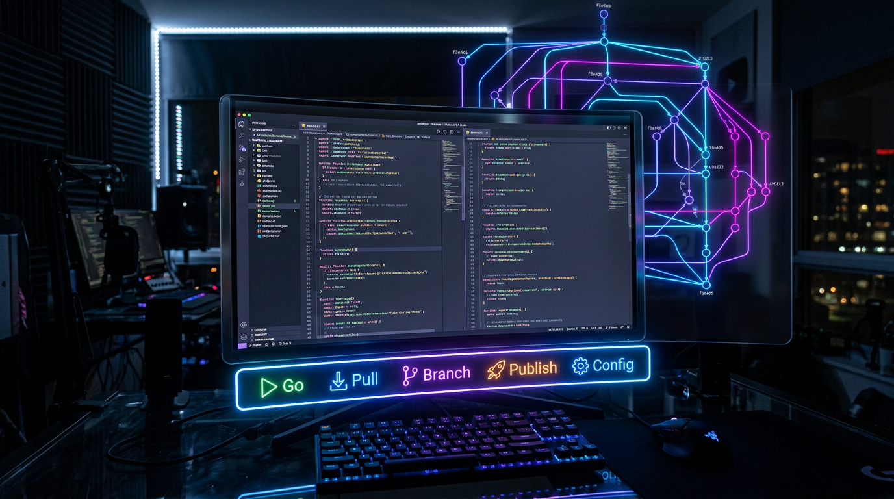

# gitm8 🤖

> AI-powered Git workflow directly inside Visual Studio Code.

<!-- 

[]
[]
[]
[] -->

---

## ✨ Why gitm8?

Stop switching between the terminal and VS Code.

gitm8 brings your entire Git workflow into the VS Code status bar with AI assistance.

✔ AI Commit Messages

✔ One-click Git Pipeline

✔ Interactive Branch Creation

✔ Smart Publish

✔ Secure API Key Storage

✔ Beautiful VS Code Integration

---

<!-- ## 🎥 See it in action

> GIF showing the entire workflow


--- -->

# 🚀 Features

## ▶ One Click Pipeline

Run

```
git add
git commit
git push
```

with a single click.

Image:
pipeline.png

---

## 🤖 AI Commit Messages

Generate meaningful commit messages using your preferred AI model.

Supports

- OpenAI
- OpenRouter
- Ollama
- LM Studio
- Any OpenAI-compatible API

Image:
commit.png

---

## 🌿 Smart Branch Creation

Create branches interactively.

Choose:

- base branch
- branch name

without remembering Git commands.

Image:
branch.png

---

## 🚀 Publish

Publish current branch

Automatically

- push
- set upstream
- optionally create PR

Image:
publish.png

---

## ⚙ Configuration

Manage

- API Key
- Model
- Tone
- Pipeline

without leaving VS Code.

Image:
config.png

---

<!-- # 📷 Screenshots

Status Bar


Configuration


Branch Creation


--- -->

# 📦 Installation

## 1

Install CLI

```bash
npm install -g gitm8
```

---

## 2

Install VS Code Extension

Marketplace

or

VSIX

---

## 3

Configure API Key

Open

```
GitM8: Open Configuration
```

Done.

---

# ⚡ Quick Start

Click

▶ Go

or

```
Ctrl+Shift+P
# gitm8 🤖

> AI-powered Git workflow directly inside Visual Studio Code.


[]
[]
[]
[]

---

## ✨ Why gitm8?

Stop switching between the terminal and VS Code.

gitm8 brings your entire Git workflow into the VS Code status bar with AI assistance.

✔ AI Commit Messages

✔ One-click Git Pipeline

✔ Interactive Branch Creation

✔ Smart Publish

✔ Secure API Key Storage

✔ Beautiful VS Code Integration

---

## 🎥 See it in action

> GIF showing the entire workflow


---

# 🚀 Features

## ▶ One Click Pipeline

Run

```
git add
git commit
git push
```

with a single click.

Image:
pipeline.png

---

## 🤖 AI Commit Messages

Generate meaningful commit messages using your preferred AI model.

Supports

- OpenAI
- OpenRouter
- Ollama
- LM Studio
- Any OpenAI-compatible API

Image:
commit.png

---

## 🌿 Smart Branch Creation

Create branches interactively.

Choose:

- base branch
- branch name

without remembering Git commands.

Image:
branch.png

---

## 🚀 Publish

Publish current branch

Automatically

- push
- set upstream
- optionally create PR

Image:
publish.png

---

## ⚙ Configuration

Manage

- API Key
- Model
- Tone
- Pipeline

without leaving VS Code.

Image:
config.png

---

# 📷 Screenshots

Status Bar


Configuration


Branch Creation


---

# 📦 Installation

## 1

Install CLI

```bash
npm install -g gitm8
```

---

## 2

Install VS Code Extension

Marketplace

or

VSIX

---

## 3

Configure API Key

Open

```
GitM8: Open Configuration
```

Done.

---

# ⚡ Quick Start

Click

▶ Go

or

```
Ctrl+Shift+P

GitM8: Run Pipeline
```

That's it.

---

# ⚙ Settings

| Setting | Description | Default |
|----------|-------------|---------|
| apiBaseUrl | AI endpoint | OpenAI |
| model | AI model | gpt-4o-mini |
| tone | Commit tone | concise |
| commitStyle | Commit format | conventional |
| pipelinePrecheck | Build before push | false |
| pipelineAutoPush | Push automatically | false |

---

# ⌨ Commands

| Command | Description |
|----------|-------------|
| Go | Full pipeline |
| Pull | Pull branch |
| Branch | Create branch |
| Publish | Push + PR |
| Config | Open settings |

---

# 🔒 Security

Your API key is stored securely using

VS Code SecretStorage.

No plaintext configuration files.

---

# Requirements

- VS Code 1.85+
- gitm8 CLI
- Git

---

# License

MIT
GitM8: Run Pipeline
```

That's it.

---

# ⚙ Settings

| Setting | Description | Default |
|----------|-------------|---------|
| apiBaseUrl | AI endpoint | OpenAI |
| model | AI model | gpt-4o-mini |
| tone | Commit tone | concise |
| commitStyle | Commit format | conventional |
| pipelinePrecheck | Build before push | false |
| pipelineAutoPush | Push automatically | false |

---

# ⌨ Commands

| Command | Description |
|----------|-------------|
| Go | Full pipeline |
| Pull | Pull branch |
| Branch | Create branch |
| Publish | Push + PR |
| Config | Open settings |

---

# 🔒 Security

Your API key is stored securely using

VS Code SecretStorage.

No plaintext configuration files.

---

# Requirements

- VS Code 1.85+
- gitm8 CLI
- Git

---

# License

MIT